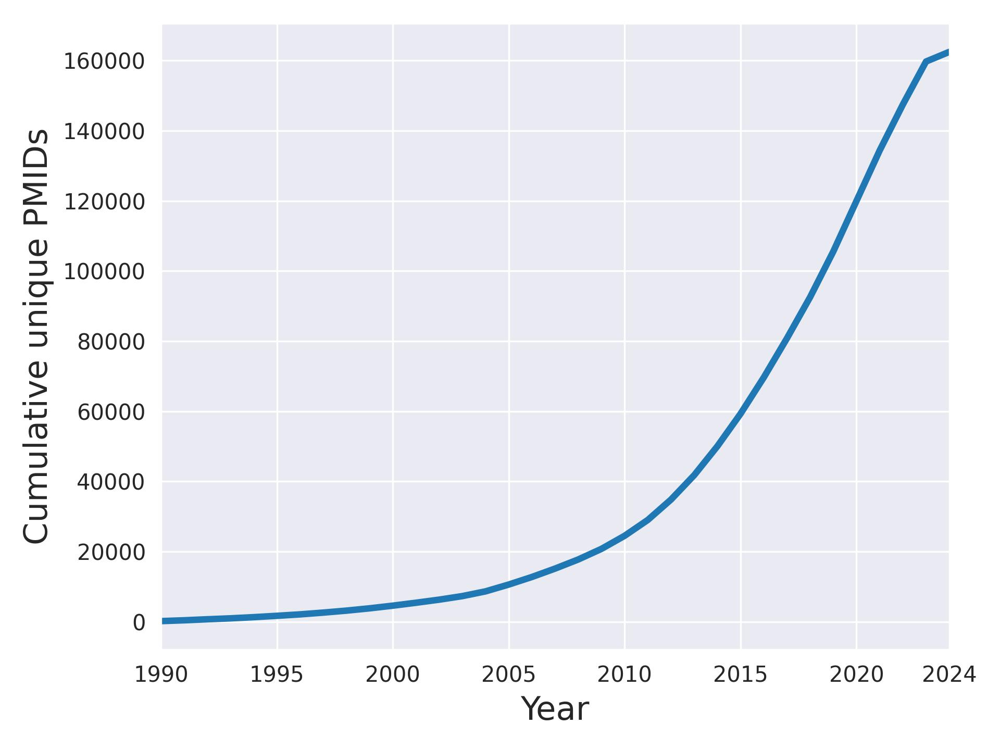

# Meta Analysis

# Search strategy in Medline and meta-analyses selection
The object was to retrieve all records in MEDLINE which were peer reviewed reports of meta-analysis studies.

 

A targeted search was designed to retrieve all records which were tagged with a meta-analysis publication type, or had been allocated a ‘meta-analysis’ keyword heading by the study author, or which had the term ‘meta-analysis’ in the title. This approach was adopted in order to retrieve the highest possible result while minimising the retrieval of irrelevant records.

 

The search below was carried out using the OVID MEDLINE (ALL) segment 1946 – 30th September 2024 with no date or language restrictions.

 

Records which were tagged with the publication types of non-fully published peer reviewed material were excluded.

 

A total of 243,729 records were exported into Endnote and then into .csv files for further analysis.

 

 

OVID MEDLINE (ALL) segment

 

1.         meta analysis.pt.

2.         (meta analysis or meta-analysis or metaanalysis).kf.

3.         (meta analysis or meta-analysis or metaanalysis).ti.

4.         1 or 2 or 3

5.         (comment or congress or editorial or letter or news or preprint).pt.

6.         4 not 5

 

 

We finally included 162’478 unique reports published 01/1990-09/2024 and having at least one primary MeSH heading with the corresponding subheading available.

# DataFrame
The final [dataframe](mesh_df.csv) includes 162,478 unique reports of meta analysis listed in Medline in between 01.1990 to 09.2024.

## Supplementary

### Cumulative Histogram of Meta-analysis listed in Medline

### The most often used primary MeSH terms

### The least often used primary MeSH terms
